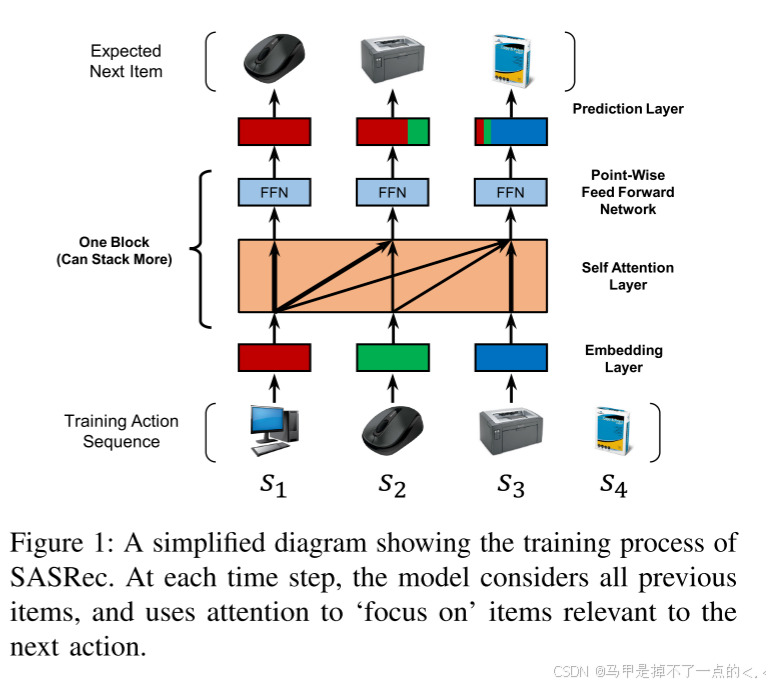
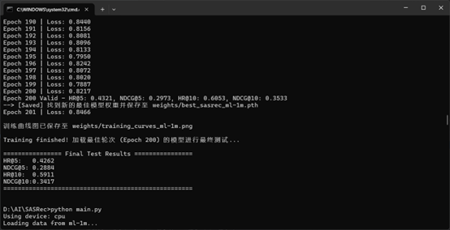
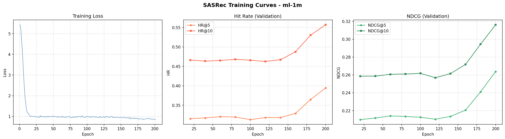
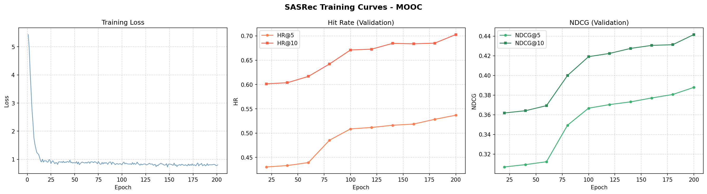

# SASRec — 逐次推薦モデル（Sequential Recommendation）

>これは SASRec (Self-Attentive Sequential Recommendation) の PyTorch による再現実装リポジトリです。
>MovieLens 1M データセットに加え、中国の MOOC プラットフォームにおける学生の選課データセット（逐次行動データ）に対応し>ています。
>データの前処理（IDリマッピング）から、Self-Attention を用いたモデル学習、および HR/NDCG 指標による精度評価までを一貫してサポートしています。
> ユーザーの行動履歴（アイテム閲覧・受講順序など）をもとに、次に興味を持つアイテムを予測する逐次推薦モデルです。

---

## 目次

1. [プロジェクト概要](#1-プロジェクト概要)
2. [モデルアーキテクチャ](#2-モデルアーキテクチャ)
3. [ファイル構成](#3-ファイル構成)
4. [動作環境・依存ライブラリ](#4-動作環境依存ライブラリ)
5. [セットアップ手順](#5-セットアップ手順)
6. [データの準備](#6-データの準備)
7. [学習の実行](#7-学習の実行)
8. [コマンドライン引数一覧](#8-コマンドライン引数一覧)
9. [出力ファイルの説明](#9-出力ファイルの説明)
10. [評価指標の説明](#10-評価指標の説明)
11. [参考文献](#11-参考文献)

---

## 1. プロジェクト概要

SASRec（Self-Attentive Sequential Recommendation）は、Transformer の自己注意機構（Self-Attention）を逐次推薦に応用したモデルです。ユーザーの過去のアイテム操作履歴を時系列として入力し、次に操作するアイテムを高精度に予測します。

### 対応データセット

| データセット | 説明 |
|---|---|
| **MOOC** | オンライン学習プラットフォームのコース受講履歴 |
| **ML-1M** | MovieLens 1M（映画評価データ） |
| その他 | 任意の `user item` 形式のテキストファイル |

### 主な特徴

- Transformer ベースの自己注意機構により長距離の依存関係を捉える
- 位置エンベディングによる順序情報の保持
- バイナリクロスエントロピー損失による効率的な学習
- マルチプロセスによる高速なバッチサンプリング
- 学習曲線の自動可視化・保存

---

## 2. モデルアーキテクチャ

<p align="center">
  
</p>

---

## 3. ファイル構成

```
SASRec/
│
├── main.py            # 学習・評価・可視化のメインスクリプト
├── model.py           # SASRec モデル定義（Self-Attention / FFN）
├── utils.py           # データ読み込み・サンプリング・評価関数
├── dat2txt.py         # ML-1M 生データを txt 形式に変換するスクリプト
│
├── data/              # データディレクトリ（.gitignore 対象）
│   ├── ml-1m.txt
│   └── MOOC.txt      
│
├── weights/           # 学習済み重み・グラフ保存先（.gitignore 対象）
│   ├── best_sasrec_MOOC.pth
│   └── training_curves_MOOC.png
│
├── requirements.txt   # 依存ライブラリ一覧
├── .gitignore
└── README.md
```

---

## 4. 動作環境・依存ライブラリ

### 推奨環境

| 項目 | 推奨 |
|---|---|
| OS | Windows 10/11、Ubuntu 20.04+ |
| Python | 3.10 以上 |
| CUDA | 11.3 以上（GPU 使用時） |
| GPU | NVIDIA GPU（CUDA 対応） |

### 依存ライブラリ

```
torch>=1.12.0
numpy
matplotlib
pandas
```

---

## 5. セットアップ手順

### ステップ 1：リポジトリのクローン

```bash
git clone https://github.com/あなたのユーザー名/SASRec.git
cd SASRec
```

### ステップ 2：仮想環境の作成（推奨）

```bash
# conda を使用する場合
conda create -n sasrec python=3.10
conda activate sasrec

# venv を使用する場合
python -m venv venv
venv\Scripts\activate      # Windows
source venv/bin/activate   # Linux/Mac
```

### ステップ 3：PyTorch のインストール

CUDA バージョンを確認してから対応する PyTorch をインストールしてください。

```bash
# CUDA バージョンの確認
nvidia-smi
```

| CUDA バージョン | インストールコマンド |
|---|---|
| CUDA 11.3 | `pip install torch torchvision --index-url https://download.pytorch.org/whl/cu113` |
| CUDA 11.8 | `pip install torch torchvision --index-url https://download.pytorch.org/whl/cu118` |
| CUDA 12.1 | `pip install torch torchvision --index-url https://download.pytorch.org/whl/cu121` |
| CPU のみ | `pip install torch torchvision` |

### ステップ 4：その他の依存ライブラリのインストール

```bash
pip install numpy matplotlib pandas
```

または `requirements.txt` からまとめてインストール：

```bash
pip install -r requirements.txt
```

### ステップ 5：CUDA 動作確認

```bash
python test.py
```

以下のように表示されれば GPU が正常に使用できます：

```
CUDA available: True
PyTorch CUDA version: 11.3
GPU count: 1
```

---

## 6. データの準備

### データ形式

本プロジェクトは以下の形式のテキストファイルを受け付けます：

```
ユーザーID アイテムID
ユーザーID アイテムID
...
```

- スペース区切り、ヘッダーなし
- ユーザーIDとアイテムIDは **1始まりの連続整数**
- 同一ユーザーの行は **時系列順** に並んでいる必要があります

例：

```
1 93
1 492
1 47
2 282
2 162
```

### MOOC データセットの配置

```bash
mkdir data
# データファイルを data/ ディレクトリに配置
cp user-course_order.txt data/MOOC.txt
```

### MovieLens 1M データの変換

ML-1M データを使用する場合は、まず生データをダウンロードし、変換スクリプトを実行します：

```bash
# ML-1M データを data/ml-1m/ に展開後
python dat2txt.py
# → data/ml-1m.txt が生成されます
```

### データ分割方法

`utils.py` の `data_partition` 関数は以下のルールでデータを分割します：

| 分割 | 内容 |
|---|---|
| 訓練（train） | 各ユーザーの最後から3番目以前の全アイテム |
| 検証（valid） | 各ユーザーの最後から2番目のアイテム（1件） |
| テスト（test） | 各ユーザーの最後のアイテム（1件） |

> インタラクション数が3未満のユーザーは訓練データのみに含まれます。

---

## 7. 学習の実行

### 基本的な実行コマンド

```bash
# MOOC データセットで学習
python main.py --data MOOC

# ML-1M データセットで学習
python main.py --data ml-1m

# GPU を明示的に指定して学習
python main.py --data MOOC --device cuda
```

### 学習中の出力例

<p align="center">
  
</p>

---

## 8. コマンドライン引数一覧

| 引数 | デフォルト値 | 説明 |
|---|---|---|
| `--data` | `MOOC` | データセット名（`data/<name>.txt` を読み込む） |
| `--train_dir` | `default` | 学習ディレクトリ名（ログ用途） |
| `--batch_size` | `128` | ミニバッチサイズ |
| `--lr` | `0.001` | Adam オプティマイザの学習率 |
| `--maxlen` | `50` | ユーザー行動系列の最大長 |
| `--hidden_units` | `50` | エンベディング次元数・隠れ層サイズ |
| `--num_blocks` | `2` | Self-Attention ブロックの積層数 |
| `--num_epochs` | `201` | 学習エポック数 |
| `--num_heads` | `1` | Multi-Head Attention のヘッド数 |
| `--dropout_rate` | `0.5` | ドロップアウト率 |
| `--device` | `cuda` / `cpu` | 使用デバイス（自動検出） |

### 引数のカスタマイズ例

```bash
# より大きなモデルで長い系列を学習する
python main.py \
  --data MOOC \
  --hidden_units 128 \
  --num_blocks 4 \
  --num_heads 4 \
  --maxlen 100 \
  --num_epochs 300 \
  --dropout_rate 0.3

# 小規模データセット向けの軽量設定
python main.py \
  --data MOOC \
  --batch_size 64 \
  --hidden_units 32 \
  --num_epochs 100
```

---

## 9. 出力ファイルの説明

学習完了後、`weights/` ディレクトリに以下のファイルが生成されます：

| ファイル名 | 内容 |
|---|---|
| `best_sasrec_<データ名>.pth` | 検証集 NDCG@10 が最高だったエポックのモデル重み |
| `training_curves_<データ名>.png` | 学習曲線グラフ（Loss / HR / NDCG） |

### 学習曲線グラフの内容

グラフは3つのサブプロットで構成されます：

- **左**：Training Loss（エポックごとの BCE 損失）
- **中**：Hit Rate（HR@5 / HR@10）の推移
- **右**：NDCG（NDCG@5 / NDCG@10）の推移

### 評価結果 (Training Results)

モデルの学習過程における Loss と各指標（HR, NDCG）の推移は以下の通りです。

### MovieLens 1M
<p align="center">
  
</p>

### MOOC
<p align="center">
  
</p>

---

## 10. 評価指標の説明

評価は各ユーザーの正解アイテム1件 + ランダム負例100件の合計101件に対するランキングで行います。

### HR@K（Hit Rate at K）

上位K件の推薦リストに正解アイテムが含まれる割合です。

```
HR@K = (K件以内に正解が含まれたユーザー数) / (評価対象ユーザー数)
```

### NDCG@K（Normalized Discounted Cumulative Gain at K）

推薦リスト内の正解アイテムの順位を考慮した精度指標です。上位にあるほど高スコアになります。

```
NDCG@K = (1 / log2(rank + 2))   ※ rank は 0 始まり
```

---


## 11. 参考文献

- Wang-Cheng Kang, Julian McAuley. **"Self-Attentive Sequential Recommendation"**. ICDM 2018.  
  https://arxiv.org/abs/1808.09781

- MovieLens 1M Dataset：https://grouplens.org/datasets/movielens/1m/
